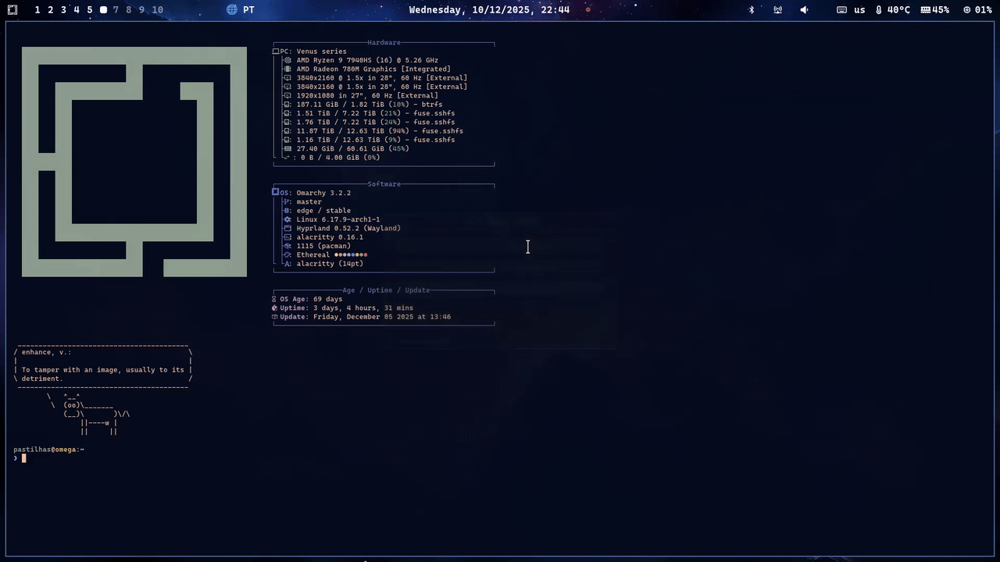

<!-- omit from toc -->
# Omarchy Mullvad

A sleek tool for managing Mullvad VPN connections with an interactive menu, Waybar integration, and Hyprland keybindings.



## Quick Install

```bash
curl -fsSL https://raw.githubusercontent.com/andrepadez/omarchy-mullvad/master/install.sh | bash
```

**Or preview first with `--dry-run`:**

```bash
curl -fsSL https://raw.githubusercontent.com/andrepadez/omarchy-mullvad/master/install.sh | bash -- --dry-run
```

## Table of Contents

- [Features](#features)
- [Usage](#usage)
  - [Interactive Menu](#interactive-menu)
  - [Status (Waybar)](#status-waybar)
  - [Toggle Connection](#toggle-connection)
  - [Setup Instructions](#setup-instructions)
- [Installation](#installation)
- [Configuration](#configuration)
  - [Waybar](#waybar)
  - [Hyprland](#hyprland)
- [Requirements](#requirements)
- [License](#license)

## Features

🌍 **Interactive Menu** - Fuzzy-searchable relay selection with country flags and city icons

🏢 **Mullvad-Owned Detection** - Highlights servers owned and operated by Mullvad

📊 **Waybar Integration** - Real-time VPN status and quick toggle in your taskbar

⌨️ **Keybinding Support** - Launch the menu with a keyboard shortcut in Hyprland

🔄 **Connection Management** - Easy connect/disconnect with relay switching

🎨 **Visual Polish** - Flag emojis, server status indicators, and clean UI

## Installation

### Manual Installation

1. Clone the repository:

```bash
git clone https://github.com/andrepadez/omarchy-mullvad
cd omarchy-mullvad
```

2. Copy the script to your local bin:

```bash
cp omarchy-mullvad.sh ~/.local/bin/
chmod +x ~/.local/bin/omarchy-mullvad.sh
```

3. Create a symlink (optional):

```bash
mkdir -p ~/.local/share/omarchy/bin
ln -s ~/.local/bin/omarchy-mullvad.sh ~/.local/share/omarchy/bin/omarchy-mullvad
```

## Usage

### Interactive Menu

Launch the interactive relay selector:

```bash
omarchy-mullvad.sh
```

Features:

- 🇵🇹 Select country with flag emojis
- 🏙️ Select city from available relays
- 🏢 Mullvad-owned servers shown first with building icon
- 🖥️ Rented servers listed after with computer icon
- Auto-connects to selected relay

### Status (Waybar)

Get JSON status output for Waybar integration:

```bash
omarchy-mullvad.sh status
```

Output example:

```json
{"text":"PT","percentage":100,"class":"connected","icon":"🌎"}
```

### Toggle Connection

Quickly toggle VPN connection on/off:

```bash
omarchy-mullvad.sh switch
```

### Setup Instructions

View setup instructions for Waybar and Hyprland:

```bash
omarchy-mullvad.sh setup
```

## Configuration

### Waybar

Add this module to your Waybar configuration (`~/.config/waybar/config`):

```json
"custom/mullvad": {
  "format": "{icon} {text}",
  "return-type": "json",
  "interval": 2,
  "format-icons": [
    "🌐",
    "🌍"
  ],
  "tooltip": false,
  "exec": "~/.local/bin/omarchy-mullvad.sh status",
  "on-click": "~/.local/bin/omarchy-mullvad.sh"
}
```

Then add `"custom/mullvad"` to your bar modules list:

```json
"modules-right": ["custom/mullvad", ...]
```

#### Styling

Optional CSS to customize appearance in `~/.config/waybar/style.css`:

```css
#custom-mullvad {
  color: #8be9fd;
  margin: 0 10px;
}

#custom-mullvad.connected {
  color: #50fa7b;
}

#custom-mullvad.disconnected {
  color: #ff79c6;
}
```

### Hyprland

Add this keybinding to your Hyprland config (`~/.config/hypr/hyprland.conf`):

```conf
bind = SUPER SHIFT, V, mullvad, exec, ~/.local/bin/omarchy-mullvad.sh
```

Or use the dispatcher directly:

```conf
bind = SUPER SHIFT, V, exec, ~/.local/bin/omarchy-mullvad.sh
```

## Requirements

- **mullvad** - Mullvad VPN client
- **walker** - Fuzzy finder for menu
- **jq** - JSON processor

### Installation

**Arch Linux / Manjaro:**

```bash
sudo pacman -S mullvad walker jq
```

**Fedora:**

```bash
sudo dnf install mullvad walker jq
```

**Ubuntu / Debian:**

```bash
sudo apt install jq
# Install mullvad and walker from their respective sources
```

## Troubleshooting

### Script not found in PATH

Make sure `~/.local/bin` is in your `$PATH`:

```bash
echo $PATH | grep ~/.local/bin
```

If not, add to your shell config (`~/.bashrc`, `~/.zshrc`, etc.):

```bash
export PATH="$HOME/.local/bin:$PATH"
```

### "No servers match your settings" error

This happens when there are conflicting relay constraints. The script automatically resets these, but if you encounter issues:

```bash
mullvad relay set provider any
```

### Walker menu not showing

Ensure you're using a compatible terminal. Recommended:

- WezTerm
- Alacritty
- Ghostty
- Kitty

## License

MIT License - See LICENSE file for details

## Contributing

Contributions are welcome! Please feel free to submit a Pull Request.

---

**Made with ❤️ for Mullvad VPN users**

